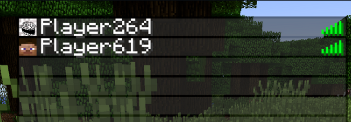
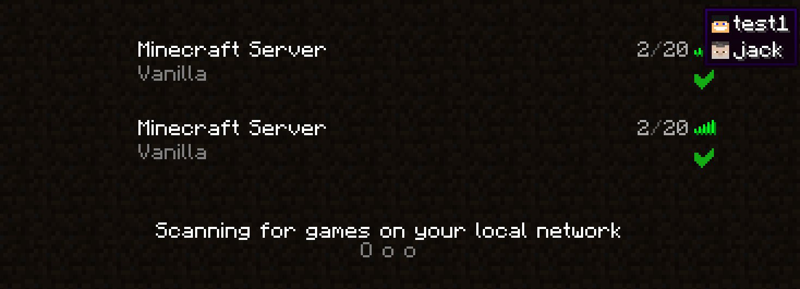
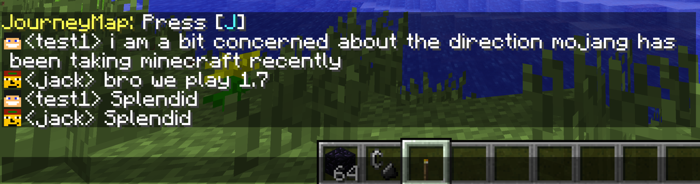

# TabFaces mod for Minecraft Forge 1.7.10

## Downloads
| [CurseForge ](https://www.curseforge.com/minecraft/mc-mods/tabfaces) |
| ---------- |
| [Modrinth ](https://modrinth.com/mod/tabfaces)   |
| [Git ](https://github.com/JackOfNoneTrades/TabFaces/releases)        |

## Dependencies

* As of version 1.0.2, [UniMixins](https://modrinth.com/mod/unimixins) (, , ) is a required dependency.
* As of version 1.0.4, [CarbonConfig](https://modrinth.com/mod/carbon-config) (, , ) is a required dependency.

## FAQ
### What does this mod do?

* Player faces in the tab menu backport.
* Player faces in the server selection menu (`1.0.2`).
* Player faces in the chat (`1.0.5`).
* Player faces in the TabbyChat ( ) (`1.0.7`).

### Client? Server? What side?

As of version `1.0.2`, client only, will do nothing on the server.

### Will this work with [insert auth mod]?

It should work on all online servers. Tested on a clean server and one treated with authlib-injector.

### Building

`./gradlew build`.

## License

`LgplV3 + SNEED`.

## Buy me a coffee

* [ko-fi.com](ko-fi.com/jackisasubtlejoke)
* Monero: `893tQ56jWt7czBsqAGPq8J5BDnYVCg2tvKpvwTcMY1LS79iDabopdxoUzNLEZtRTH4ewAcKLJ4DM4V41fvrJGHgeKArxwmJ`

 

