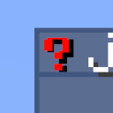
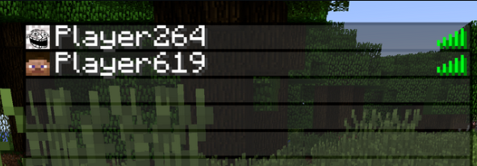
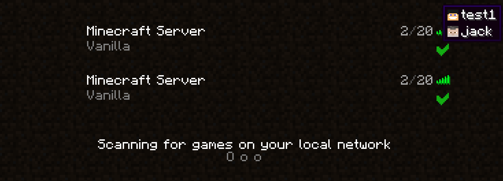
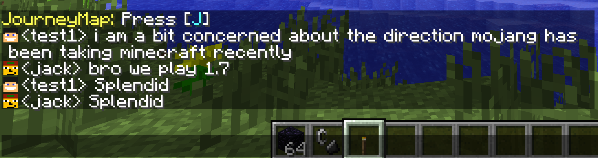

# TabFaces mod for Minecraft Forge 1.7.10

Display player faces in the server tab menu, in the chat, and the server population info tooltip.

## Dependencies

* As of version 1.0.2, [UniMixins](https://modrinth.com/mod/unimixins)    is a required dependency.
* Prior to version 1.0.10, [CarbonConfig](https://modrinth.com/mod/carbon-config)    is a required dependency.
* As of version 1.0.9, [SkinPort](https://www.curseforge.com/minecraft/mc-mods/skinport)   is an optional dependency and has added compat.

## Incompatibilities
* Better Ping Display is not compatible.

## FAQ
### What does this mod do?

* Player faces in the tab menu backport.
* Player faces in the server selection menu (`1.0.2`).
* Player faces in the chat (`1.0.5`).
* Player faces in TabbyChat   (`1.0.7`). Since `1.0.8` TabbyChat specific configs can be changed from the TabbyChat GUI as well.

### Client? Server? Which side?

* As of version `1.0.2`, client only, will do nothing on the server.
* As of version `1.0.8`, server is required for ServerUtilities  compat.

### Will this work with [insert auth mod]?

It should work on all online servers. Tested on a clean server and one treated with [authlib-injector](https://github.com/yushijinhun/authlib-injector).

### Building

`./gradlew build`.

## License

`LgplV3 + SNEED`.

## Buy me a coffee

* [ko-fi.com](ko-fi.com/jackisasubtlejoke)
* Monero: `893tQ56jWt7czBsqAGPq8J5BDnYVCg2tvKpvwTcMY1LS79iDabopdxoUzNLEZtRTH4ewAcKLJ4DM4V41fvrJGHgeKArxwmJ`

 

